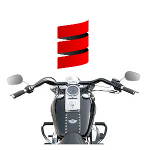

  
# Scalabars [](https://opensource.org/licenses/MIT)  
[](https://bintray.com/blocke/releases/scalabars/_latestVersion)  
[](https://travis-ci.org/gzoller/Scalabars)  
[](https://www.codacy.com/app/gzoller/Scalabars?utm_source=github.com&amp;utm_medium=referral&amp;utm_content=gzoller/Scalabars&amp;utm_campaign=Badge_Grade)  
[](https://coveralls.io/github/gzoller/Scalabars)  
  
   
Scalabars is a Scala implementation of the Handlebars templating engine.  It is mostly compatible with  4.x series Handlebars, with some exceptions that just don't make sense in the Scala world.  
  
Helpers can be written in Scala, or in JavaScript.  JavaScript helpers should be compatible with Handlebars as long as authors don't do anything too crazy in their scripts (e.g. call external JavaScript libraries, for example).  
  
The advantage of writing helpers in pure Scala and not using any JavaScript helpers is that the engine should then be entirely thread-safe, which of course JavaScript-native Handlebars is not.  
  
## Use  
  
To install and use Scalabars include it in your projects by adding the following to your build.sbt:  
 ``` 
 libraryDependencies ++= Seq("co.blocke" %% "scalabars" % "0.1.0")  
 ```

Use like this in your code:

```scala
val sb = Scalabars()

val data = val json = org.json4s.native.JsonMethods.parse("""
{
  "data": "Your json data here..."
}
""".stripMargin)

val template = """This is a {{data}} test"""

sb.compile(template)(json)  // Returns rendered string
``` 

You also have the option of using a case class instead of JSON data if that's more useful:

```scala
case class Person(name:String, age:Int)

val person = Person("Mike",32)
sb.compile("Hello, {{name}}")(person)
```

### Handlebars Compile Options
Several stock Handlebars compile options work in Scalabars.  Those not supported didn't make sense in Scala, and were ignored.

- `noEscape`: Set to true to not HTML escape any content.
- `strict`: Run in strict mode. In this mode, templates will throw rather than silently ignore missing fields. This has the side effect of disabling inverse operations such as  `{{^foo}}{{/foo}}`  unless fields are explicitly included in the source object.
- `preventIndent`: By default, an indented partial-call causes the output of the whole partial being indented by the same amount. This can lead to unexpected behavior when the partial writes  `pre`-tags. Setting this option to  `true`  will disable the auto-indent feature.
- `explicitPartialContext`: Disables implicit context for partials. When enabled, partials that are not passed a context value will execute against an empty object.
- `ignoreStandalone`: Disables standalone tag removal when set to  `true`. When set, blocks and partials that are on their own line will not remove the whitespace on that line.

Use options like this:

```scala
sb.compile("{{foo}}", Map("preventIndent"->true, "strict"->true"))(json)
```

## Developing Your Own Helpers  
  
* [Scala](scalaHelper.md)  
* [JavaScript](jsHelper.md)  
  
## Included Helpers (thread-safe)  
  
#### Stock Handlebars Built-In Helpers  
* each  
* if  
* lookup  
* until  
* with  
  
#### Extra Helpers We Included  
Most of these (and the examples/documentation) can be found at [https://assemble.io/helpers/](https://assemble.io/helpers/)  
* and  
* any  
* contains  
* default  
* empty  
* eq  
* first  
* join  
* last  
* length  
* lengthEquals  
* include  
* markdown  
* ne  
* raw  
* sortEach  
* or  
* url  
* withDrop  
* withFirst  
* withLast  
* withLookup  
* withTake  
  
*Blöcke*